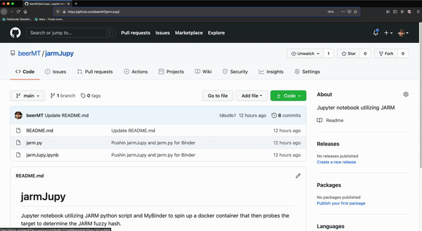

# jarmJupy
Jupyter notebook utilizing JARM python script and MyBinder to spin up a docker container that then probes the target to determine the JARM fuzzy hash.

MyBinder link:

## Short Screen Capture of Docker Spin-up Process and JARM Query

